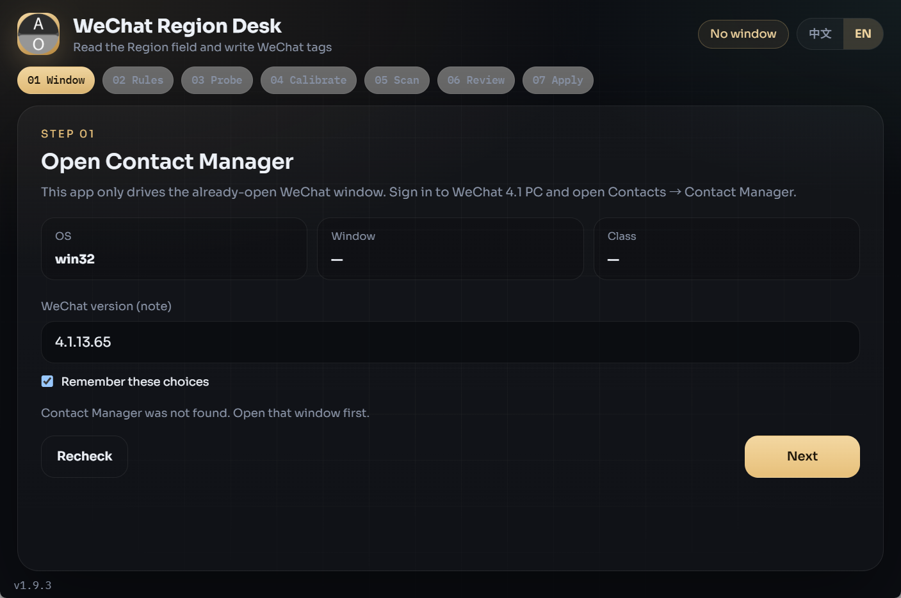

<div align="center">

# 微信地区打标台

**Packed via Axiox Media**

本地 Windows 向导：读取电脑微信 4.1「通讯录管理」里的地区字段，并按地域写入标签。

<p>
  <a href="../README.md"></a>
</p>

</div>

<p align="center">
  
</p>

> [!NOTE]
> 打包后的 EXE 未签名，首次运行可能被 SmartScreen 拦截。程序只操作本机已经打开的微信窗口。

## 流程

通道验证 → 标签规则 → 探测窗口 → 扫描通讯录 → 核对计划 → 写入标签

## 安装

推荐使用 [GitHub Deploy Desk](https://github.com/axioxmedia/github-deployer) 粘贴仓库地址安装。

或在本目录双击 `build_exe.bat`，生成 `dist\WeChatRegionDesk.exe`。源码运行：

```bat
python -m venv .venv
.venv\Scripts\activate
pip install -r requirements.txt
python app.py
```

## 使用

1. 打开微信 4.1 → 通讯录 → 通讯录管理。
2. 启动本程序，确认窗口已连接。
3. 设定香港匹配词与空地区标签。
4. 先探测，再试扫 15 人。
5. 在表格中改 `tag_name`，合并过细城市。
6. 确认后写入标签。也可勾选「只处理香港」。

地区含「香港 / 中国香港 / Hong Kong / HK」一律写入标签「香港」。

## 注意

- 扫描期间不要操作鼠标键盘。
- 个人微信标签数量有限，城市过细请先在表格合并。
- 同名好友可能勾错，请看运行日志。
- 仅整理本人通讯录，不要在同一时段做群发。

Packed via Axiox Media · [axiox.media](https://axiox.media)
